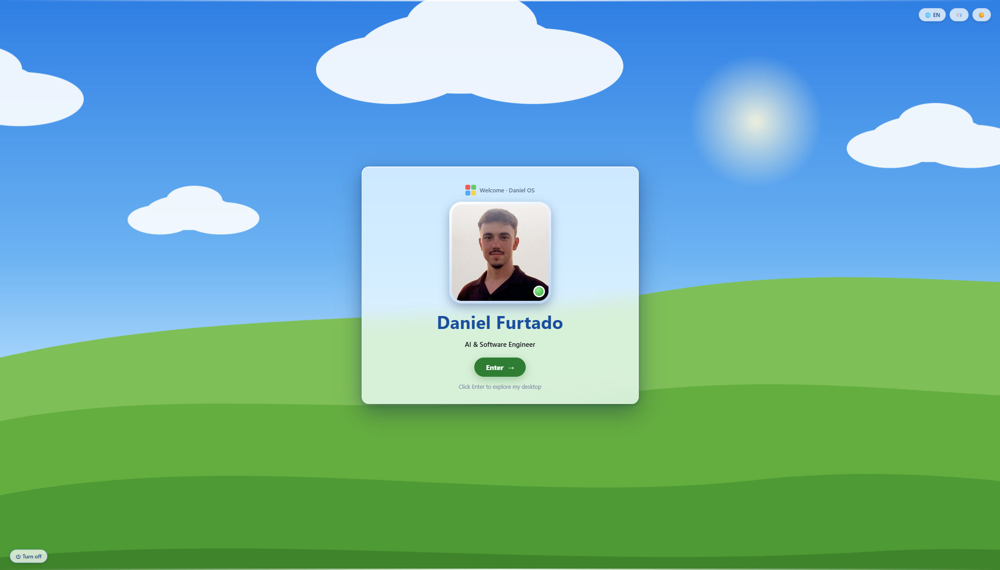
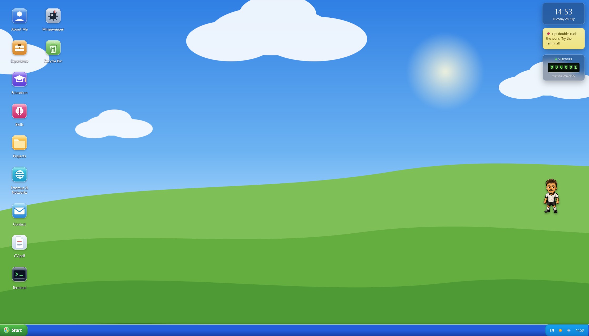

<div align="center">

# 🪟 Daniel OS

**A portfolio that boots.**

Not a page you scroll — an operating system you log into. Windows XP nostalgia,
Aero glass, draggable windows, a working Minesweeper and a terminal that
actually answers back.

### [▶ Boot it up](https://portfolio-sable-eight-93.vercel.app/)

[](https://react.dev)
[](https://www.typescriptlang.org)
[](https://vite.dev)
[](https://portfolio-sable-eight-93.vercel.app/)

</div>

---

<div align="center">

### The login screen



### The desktop



</div>

---

## Why

Every developer portfolio looks the same: hero, about, grid of cards, contact form.
This one asks you to **press Enter first**.

Each section — About, Experience, Projects — is a real window you can drag, resize,
minimise and stack. There is no scroll position to remember, only a desktop to
rummage through. It rewards curiosity: double-click the Recycle Bin, drag the pixel
character across the hills, or open the Terminal and type `sudo`.

Every pixel of the Windows-style artwork is **original** — wallpaper, icons and
startup chime are hand-built with SVG, CSS and the Web Audio API. No Microsoft
assets, no sprite rips.

## Quick start

```bash
npm install      # install dependencies
npm run dev      # dev server → http://localhost:5173
npm run build    # type-check + production build into dist/
npm run preview  # preview the production build
npm run lint     # type-check only
```

## The experience

| Stage | What happens |
| --- | --- |
| **1. Boot** | Animated splash with a progress bar. Auto-advances — click or press any key to skip. |
| **2. Login** | Glass card over rolling hills: avatar, animated name, rotating taglines and an **Enter** button. Language (PT/EN), sound and day/night toggles sit in the corner. |
| **3. Desktop** | Icons, taskbar, green **Start** menu, live clock, Aero gadgets and windows you can drag, resize, minimise, maximise and close. |

### Apps

`About Me` · `Experience` · `Education` · `Skills` · `Projects` ·
`Erasmus & Networks` · `Contact` · `CV.pdf` · `Minesweeper 💣` ·
`Terminal 🖥️` · `Recycle Bin 🗑️`

### Terminal

A real command loop, not a prop:

```
help  whoami  about  skills  projects  experience  education
contact  open <app>  ls  echo  date  sudo  clear
```

> `sudo` has an opinion about your permissions.

### Easter eggs

- 🏃 **The pixel runner** wanders the hills, cycling through custom emotes
  (work, beach, driving, football) — and you can **grab it with the mouse** and
  drop it anywhere. It carries on regardless.
- ✨ **Click sparks** burst wherever you click.
- 🌙 **Night mode** repaints only the sky and hills, so every window stays readable.
- 🔢 **Visitor odometer** — a retro seven-segment gadget counting real visits.

## Editing content

All content is **typed and bilingual (PT/EN)** in [`src/data/`](src/data/) — edit
these files, no UI changes needed:

| File | What |
| --- | --- |
| [`profile.ts`](src/data/profile.ts) | Name, bio, taglines, interests, avatar/photo paths |
| [`experience.ts`](src/data/experience.ts) | Work timeline |
| [`education.ts`](src/data/education.ts) | Degrees |
| [`skills.ts`](src/data/skills.ts) | Skill groups + bar levels |
| [`projects.ts`](src/data/projects.ts) | Project cards + repo/demo links |
| [`erasmus.ts`](src/data/erasmus.ts) | Erasmus+, networks, mentoring |
| [`contact.ts`](src/data/contact.ts) | Contact links |

UI strings (buttons, labels, window titles) live in
[`src/i18n/strings.ts`](src/i18n/strings.ts).

### Assets

| Path | What |
| --- | --- |
| `public/assets/profile_image.png` | Login avatar + "About Me" photo |
| `public/assets/emotes/*.png` | Pixel-runner sprites |
| `public/assets/og.png` | Link-preview image for social shares |
| `public/cv/Daniel-Furtado-CV.pdf` | The downloadable CV |
| `public/favicon.svg` | The four-tile logo |

Only `public/` is shipped. The untouched originals — full-resolution emotes, the
source photo — live in [`assets-source/`](assets-source/) and are never bundled;
they're kept so the sprites can be reprocessed (alpha cutout → crop → resize into
`public/assets/emotes/`) without starting from scratch.

To swap the recreated startup sound or wallpaper for other files, drop them in
`public/assets/` and update [`src/lib/sfx.ts`](src/lib/sfx.ts) and
[`src/components/Wallpaper.tsx`](src/components/Wallpaper.tsx).

## Project structure

```
src/
├─ App.tsx                 Stage machine (boot → login → desktop)
├─ stages/                 BootScreen, LoginScreen, Desktop
├─ desktop/                Window, WindowManager, Taskbar, StartMenu, icons, gadgets
├─ apps/                   One component per window + apps.config.ts + registry.tsx
├─ components/             Wallpaper, AppIcon, PixelRunner, ClickFX, HitCounter, Birds…
├─ store/useOS.ts          Zustand store: windows, focus, language, sound, theme
├─ i18n/                   Bilingual helpers + string table
├─ hooks/                  useDrag, useMediaQuery, useNow, useViews
├─ lib/sfx.ts              Synthesised Web Audio sound engine
├─ data/                   All portfolio content (typed, PT/EN)
└─ theme/                  tokens.css, xp-aero.css, apps.css, responsive.css

api/views.ts               Vercel Edge Function — visitor counter
public/                    Everything served as-is (avatar, sprites, CV, favicon)
assets-source/             Full-res originals — never bundled
docs/screenshots/          README imagery
```

Adding a window is three edits: a component in `src/apps/`, an entry in
[`apps.config.ts`](src/apps/apps.config.ts), and a line in
[`registry.tsx`](src/apps/registry.tsx).

## Deploy

1. Push to GitHub.
2. Import the repo in Vercel — `vercel.json` is included, Vite is auto-detected.
3. Deploy.

Or straight from the CLI: `npx vercel`.

Currently live at
**[portfolio-sable-eight-93.vercel.app](https://portfolio-sable-eight-93.vercel.app/)**.

> **Changing the domain?** Add it under Vercel → project → **Settings → Domains**,
> then update the three absolute URLs in the Open Graph block of
> [`index.html`](index.html) — `og:url`, `og:image` and `twitter:image`. Link
> previews on LinkedIn and WhatsApp break silently if you forget, because those
> scrapers won't resolve a relative path.

### Visitor counter

The odometer gadget is served by [`api/views.ts`](api/views.ts), a Vercel Edge
Function backed by Upstash Redis:

1. Vercel dashboard → project → **Storage** → **Upstash Redis** → create a database
   (free tier is plenty) and connect it.
2. Redeploy. The integration injects `KV_REST_API_URL` / `KV_REST_API_TOKEN`
   automatically — no code changes.

Without those env vars the endpoint returns `{ views: null }` and the gadget simply
doesn't render, so `npm run dev` stays clean. For local testing use `npx vercel dev`
with a `.env.local` (see [`.env.example`](.env.example)).

**Counting rules:** one increment per browser (localStorage flag) *and* per IP per
day (Redis `SET NX EX`), with known bot user-agents skipped. Reset by deleting the
`portfolio:views` key in the Upstash console.

## Tech

**React 19** · **Vite 6** · **TypeScript** · **Zustand** (window/OS state) ·
**Framer Motion** (window + stage animation) · **Web Audio API** (synthesised SFX) ·
**Vercel Edge Functions** + Upstash Redis.

No UI library, no CSS framework — the Aero look is hand-written CSS custom
properties in [`src/theme/`](src/theme/).

---

<div align="center">

**Daniel Furtado** — Machine Learning Engineer
[LinkedIn](https://www.linkedin.com/in/daniel-furtado-450067224/) ·
[GitHub](https://github.com/danielfurtado11) ·
[danielfurtado1109@gmail.com](mailto:danielfurtado1109@gmail.com)

</div>
